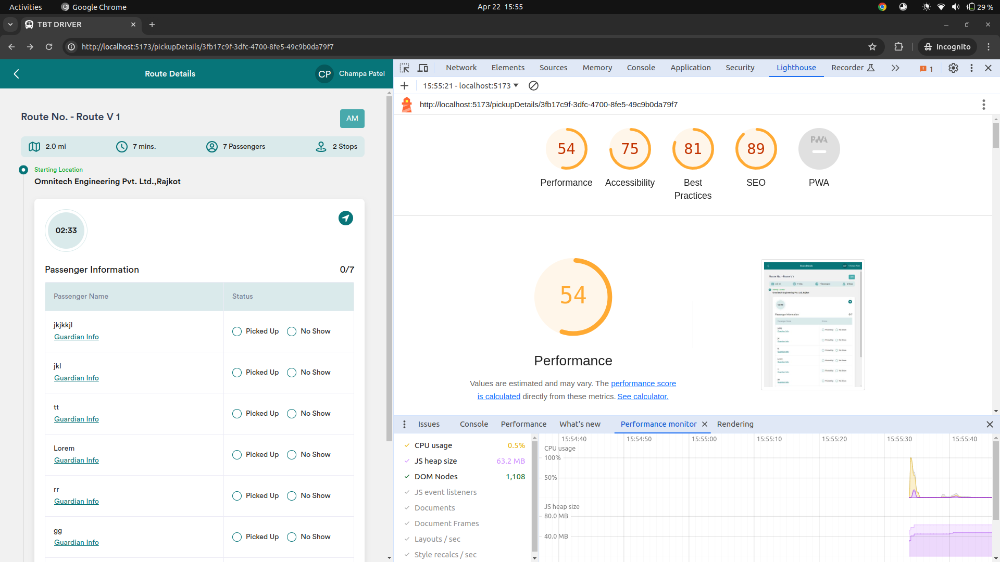
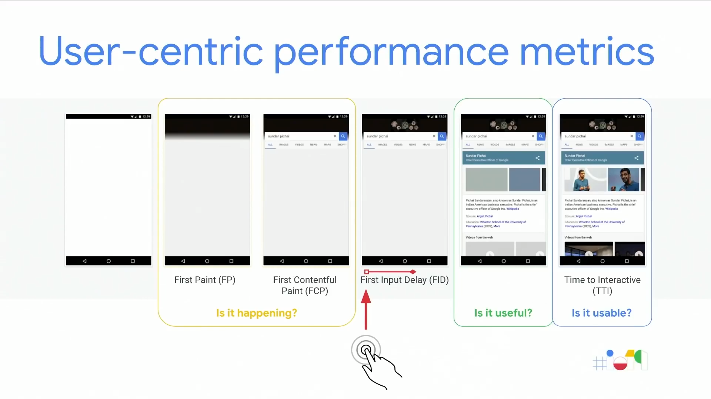

1.  [Introduction to Lighthouse Tool](#introduction-to-lighthouse-tool)
2.  [Key Metrics and Measurements](#key-metrics-and-measurements)
3.  [How Lighthouse Works](#how-lighthouse-works)
4.  [Interpreting LightHouse Results](#interpreting-lighthouse-results)
5.  [Best Practices for Performance Optimization](#best-practices-for-performance-optimization)
6.  [Optimizing LCP](#optimizing-lcp)

## Some statics showing importance of APP performance


<!-- ## before optimization



 -->

<!-- ### Improve LCP


 -->

## Introduction to Lighthouse Tool

### What is Lighthouse?

Lighthouse is an open-source tool developed by Google that analyzes web pages, providing audits and recommendations to improve performance, accessibility, SEO, and more.

#### Purpose and Key Features of Lighthouse:

Overview of Lighthouse's role in assessing and optimizing web page performance.
Key features include comprehensive audits, performance scoring, and actionable recommendations.

#### Importance of Performance Measurement:

Highlight the significance of performance optimization for user experience, SEO rankings, and overall website success.

## Key Metrics and Measurements

Performance Metrics Tracked by Lighthouse:


### Loading Performance:

#### First Contentful Paint (FCP):

- **Definition**:
  - Measures the time when the browser first renders any content on the screen during page load.
- **Optimal Value**:
  - Lower is better. Aim for FCP values under 2 seconds for a good user experience.

#### Largest Contentful Paint (LCP):

- **Definition**:
  - Measures the render time of the largest content element visible within the viewport.
- **Optimal Value**:

  - Lower is better. Target LCP values under 2.5 seconds to ensure fast loading of critical page content.

  

#### Time to Interactive (TTI):

- **Definition**:
  - Measures the time it takes for a web page to become fully interactive and responsive to user input.
- **Optimal Value**:
  - Lower is better. Aim for TTI values under 5 seconds for a responsive and engaging user experience.

### Interactivity Metrics:

#### Total Blocking Time (TBT):

- **Definition**:

  - Measures the total amount of time during page load when the main thread is blocked and unable to respond to user input.

- **Optimal Value**:
  - Lower is better. Aim for TBT values under 300 milliseconds (ms) to minimize delays in user interaction.

#### Input Delay (also known as Time to Interactive - TTI):

- **Definition**:

  - Measures the delay in responsiveness when the page becomes fully interactive and responsive to user input.

- **Optimal Value**:
  - Lower is better. Aim for Input Delay (TTI) values under 100 milliseconds (ms) for a smooth and responsive user experience.

### Visual Stability:

#### Cumulative Layout Shift (CLS):

- **Definition**:

  - Measures the visual stability of a web page by quantifying the cumulative movement of elements within the viewport during page load.

- **Optimal Value**:
  - Lower is better. Aim for CLS values under 0.1 to ensure a stable and predictable layout during user interactions.


#### Accessibility and SEO Metrics:

Accessibility score, SEO score, Meta tags analysis.

## How Lighthouse Works

### Running Audits from Chrome DevTools:

#### 1. Open Chrome DevTools

- Launch Google Chrome on your computer.
- Navigate to the webpage you want to audit.
- Right-click on any part of the page and select "Inspect" from the context menu. Alternatively, use `Ctrl + Shift + I` (Windows/Linux) or `Cmd + Opt + I` (Mac) to open DevTools.

#### 2. Navigate to the Audits Panel

- Once DevTools is open, you'll see a set of tabs at the top of the DevTools pane.
- Click on the "Audits" tab. If you don't see it, click on the ">>" button to reveal additional tabs.

#### 3. Set Up Audit Configuration

- In the Audits panel, customize your audit settings:
  - Choose the categories you want to include in your audit (e.g., Performance, Accessibility, Best Practices, SEO).
  - Select the device type (mobile or desktop) in the "Device" dropdown menu.

#### 4. Start the Audit

- After configuring settings, click "Run audits" to start the audit process.
- Chrome will analyze the webpage based on selected criteria. This may take a few moments.

#### 5. Review Audit Results

- Once the audit is complete, view a detailed report of webpage performance and metrics.
- Each category displays a score and a list of issues with recommendations for improvement.
- Expand each category to view details about individual audit items.

#### 6. Interpret and Take Action

- Review findings and prioritize issues for improvement.
- Click on items to learn more about problems and access helpful resources.
- Use audit results to optimize your webpage for better performance, accessibility, SEO, and best practices.

### Using Lighthouse in the Command Line:

#### 1. Install Lighthouse

Ensure you have Node.js installed on your computer. Then, install Lighthouse globally using npm:

```bash
npm install -g lighthouse
```

#### 2. Run Lighthouse Audit

Open your terminal or command prompt, and execute the following command to generate an audit report for a specific webpage:

```bash
lighthouse https://example.com --output html --output-path report.html --view
```

You can also generate report in json and csv format using following commands respectively:

**JSON**

```bash
lighthouse https://example.com --output json --output-path report.json --view
```

**CSV**

```bash
lighthouse https://example.com --output csv --output-path report.csv --view
```

## Interpreting LightHouse Results:

#### What each metric signifies:

- **First Contentful Paint (FCP)**:

  - Indicates when the first content (text, image, etc.) is rendered on the screen.
  - Measures perceived loading speed and how quickly users see meaningful content.

- **Speed Index**:

  - Represents how quickly content is visually displayed during page load.
  - Measures how quickly the content is painted on the screen.

- **Largest Contentful Paint (LCP)**:

  - Measures the render time of the largest content element visible in the viewport.
  - Helps assess how quickly the main content of the page is loaded.

- **Time to Interactive (TTI)**:

  - Indicates when the page becomes fully interactive and responsive to user input.
  - Measures the time taken for all critical resources to load and event handlers to be registered.

- **Total Blocking Time (TBT)**:

  - Measures the total amount of time the main thread is blocked during page load.
  - Quantifies responsiveness issues due to long tasks.

- **Cumulative Layout Shift (CLS)**:
  - Measures the visual stability of the page by quantifying unexpected layout shifts.
  - Helps assess user experience and prevents elements from moving unexpectedly during page load.

#### How to interpret scores and recommendations:

- **Scores**:

  - Higher scores indicate better performance and user experience.
  - Each metric's score provides insights into specific areas of improvement.

- **Recommendations**:
  - Lighthouse provides actionable recommendations based on audit results to improve performance.
  - Each recommendation typically includes details on how to implement the suggested improvements.

#### Identifying areas for improvement based on results:

- **Review Audit Results**:

  - Analyze Lighthouse audit results to identify metrics with lower scores and corresponding recommendations.

- **Focus on Critical Metrics**:

  - Prioritize improvements based on critical metrics like FCP, LCP, TTI, and TBT that directly impact user experience.

- **Implement Optimization Techniques**:

  - Address recommendations by optimizing assets, reducing unnecessary code, and improving server response times.

- **Monitor Changes and Re-audit**:

  - Regularly re-audit using Lighthouse to track performance improvements over time.

- **Iterative Optimization**:
  - Continuously iterate on optimizations based on audit results and user feedback to ensure ongoing performance enhancements.

## Best Practices for Performance Optimization

Strategies to improve performance based on LightHouse recommendations:

#### Caching and Asset Optimization

Caching involves storing copies of files or data temporarily to enable faster retrieval, reducing server load, and speeding up website performance by serving cached content.

Asset optimization focuses on reducing the size and improving the delivery of website resources to enhance loading speed and user experience.

#### Image and Resource Optimization

Image Optimization:

- Minimizes file size while maintaining visual quality.
- Techniques include resizing, using efficient formats (JPEG, PNG, WebP), and compressing images.

Resource Optimization:

- Extends to all web assets like scripts, stylesheets, fonts, icons, and multimedia content.
- Involves optimizing file sizes, eliminating redundancy, and enhancing delivery methods.

#### Script and CSS Optimizations

Script Optimizations:

- Improve the performance of JavaScript and other scripts.
- Techniques include minification, bundling, lazy loading, and optimizing script execution.

CSS Optimizations:

- Focus on reducing file size, eliminating redundancy, and using efficient selectors.
- Prioritize loading critical CSS first to optimize rendering and improve page load times.

## Optimizing LCP

### High-Level Goal:
- Spend the bulk of your time fetching LCP resources.
- Spend as little time as possible doing anything else(i.e.,load delay, render delay)

### LCP breakdown

-**Time to first byte (TTFB)**
-The time from when the user initiates loading the page until the browser receives the first byte of the HTML document response.

-**Resource load delay**
-The time between TTFB and when the browser starts loading the LCP resource. If the LCP element doesn't require a resource load to render (for example, if the element is a text node rendered with a system font), this time is 0.

-**Resource load time**
-The time it takes to load the LCP resource itself. If the LCP element doesn't require a resource load to render, this time is 0.

-**Element render delay**
-The time between when the LCP resource finishes loading and the LCP element rendering fully.


### Target for LCP:


#### Recipe for Optimizing LCP

Step 1:

- Ensure the LCP resource starts loading as early as possible.
- Add priority hints or preload

Step 2:

- Ensure LCP element can be rendered immediately after the resource has finished loading.
- Defer render-blocking JS


Step 3:

- Reduce resource load time without compromising quality
- Use modern image formats(avif, webp)
- Properly size images and use cdn 

